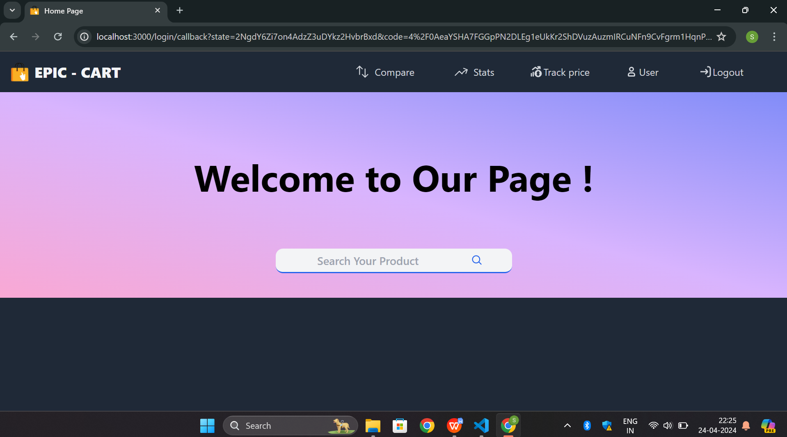

  # EPIC-CART
- This project is a web scraping and analysis tool designed to compare products across two popular e-commerce platforms. It helps users make informed purchase decisions by analyzing customer reviews and identifying the product with the best reviews. The project leverages web scraping techniques to extract relevant data from e-commerce websites and processes it to deliver meaningful insights.

# Features
- Compare Products Across Platforms:
Fetches product details, including pricing, specifications, and reviews, from two e-commerce platforms.

- Customer Review Analysis:
Extracts and analyzes customer reviews to highlight the product with the best feedback based on overall sentiment.

- User-Friendly Comparison Metrics:
Displays comparative data in a structured format, making it easy to assess key differences between the products.

# Technology Stack
- Web Scraping:
    - Tools/Libraries: BeautifulSoup, Selenium
    - Purpose: Extract product data and customer reviews.
- Data Analysis:
    -Tools/Libraries: Pandas, NLTK or TextBlob for sentiment analysis.
- Frontend:
    - HTML, CSS, JavaScript: To present the comparison data visually.
- Backend:
    - Python: To manage data processing and analysis.

# How It Works
1) Data Extraction:
    The scraper navigates the two e-commerce platforms, collects product information (name, price, features) and customer reviews for specified search queries.
2) Data Cleaning and Processing:
    Extracted data is cleaned and stored in a structured format (e.g., JSON or database).
3) Review Analysis:
    Customer reviews are analyzed using natural language processing (NLP) techniques to determine sentiment scores.
4) Product Comparison:
    A comparison report is generated, showing the best-reviewed product along with other relevant metrics such as price differences and key features.
5) Output:
    The results are displayed in a tabular or graphical format for easy comparison.

# Installation and Setup
1) Clone the repository:
git clone https://github.com/yourusername/ecommerce-comparison.git
cd ecommerce-comparison

2) Install dependencies:
pip install -r requirements.txt

3)Run the project:
python main.py
rategic insights.

# Screenshots
- Login page

- Home page

- Product page

- Product page

- Comparison page

- Review Page

# Future Enhancements
- Add more e-commerce platforms for comparison.
- Implement graphical dashboards for better visualization of results.
- Enable user interaction through a web-based interface.
- Automate the comparison process using APIs (if available).
